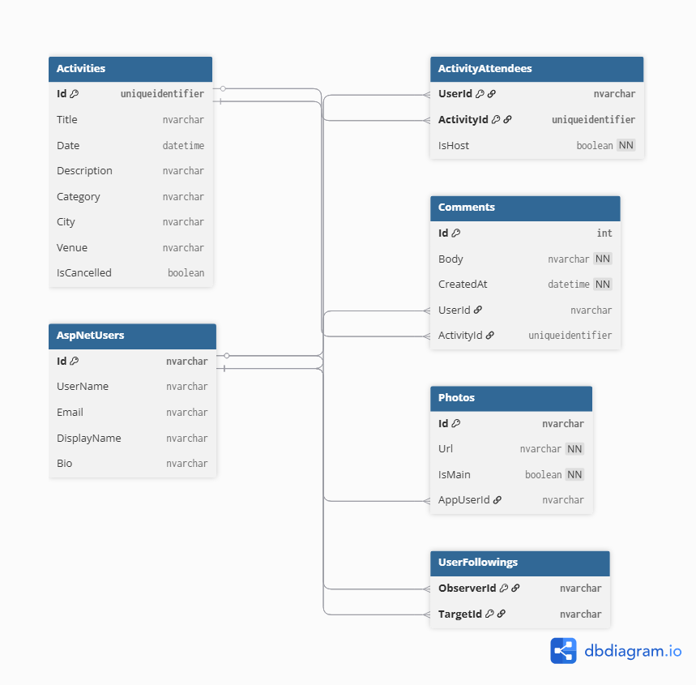

# Reactivities - Ứng dụng Mạng xã hội Hoạt động

Reactivities is a full-stack web application built with ASP.NET Core for the backend and ReactJS for the frontend. It serves as a social platform where users can create, join, and comment on various activities.

**[Live Demo](https://reactivities-wispy-sun-2134.fly.dev)**

_(Hãy thay thế ảnh chụp màn hình bên dưới bằng ảnh thực tế của ứng dụng bạn)_

---

## ► Key Features

1. Comprehensive Activity Management
   - Create & Edit: Authenticated users can create new activities with full details, including title, description, category, date, city, and venue. The host of an activity has full permission to edit or cancel it.
   - List & Filter: The homepage displays a list of upcoming activities. Users can filter them by: “All Activities,” “Activities I’m Attending,” and “Activities I’m Hosting.”
   - Activity Details: Each activity has its own detail page showing full information, a list of attendees, and a real-time comment section.
2. Authentication & Authorization
   - Register & Login: Built with ASP.NET Core Identity. Users can register with an email and password.
   - GitHub OAuth Login: For convenience, users can sign in with their GitHub accounts via OAuth 2.0.
   - Email Verification: To enhance security, users must verify their email address. A verification link is sent via email (using Resend API), and the account remains inactive until it’s confirmed.
3. Social Interactions
   - Join/Leave Activities: Logged-in users can join or leave any activity. The host is automatically marked as an attendee.
   - Real-Time Comments: Each activity includes a live comment section powered by SignalR. New comments appear instantly for all users viewing the activity page, with no page refresh required.
   - User Profiles: Each user has a public profile displaying their avatar, bio, and a list of upcoming activities. Users can update their personal information.
4. Photo Management
   - Cloudinary Integration: All uploaded images (e.g., avatars) are stored, optimized, and served via Cloudinary.
   - Profile Photos: Users can upload and set a main profile image.
5. Backend Architecture
   - Clean Architecture & CQRS: The backend follows a clean architecture pattern, with clear separation of concerns between Domain, Application, Infrastructure, and API layers.
   - CQRS with MediatR: Commands and queries are fully separated using MediatR, improving maintainability and performance tuning.
   - Centralized Error Handling: A custom exception middleware catches and formats all server-side errors into consistent JSON responses, simplifying frontend debugging.

## ► Technologies Used

### **Backend**

- **Framework:** .NET 9, ASP.NET Core
- **Architecture:** Clean Architecture, CQRS Pattern with MediatR
- **Database:** Entity Framework Core, PostgreSQL (hosted on Neon)
- **Authentication:** ASP.NET Core Identity
- **Real-time:** SignalR
- **External Services:**
  - **Cloudinary:** Image hosting and optimization
  - **Resend:** Transactional email delivery
  - **GitHub OAuth:** Third-party login integration

### **Frontend**

- **Framework:** ReactJS , TypeScript
- **Build Tool:** Vite
- **State Management:** MobX
- **Routing:** React Router
- **UI Library:** Material-UI (MUI)
- **HTTP Client:** Axios
- **External Services:**
  - **LocationIQ** Provides real location suggestions based on user-entered addresses

### **Deloyment**

- **Nền tảng:** Fly.io
- **CI/CD:** GitHub Actions – auto-build and deploy on push to the `main` branch
- **Mô hình:** Unified deployment – the ASP.NET Core backend serves both the API and the React frontend (from the `wwwroot` folder)

---

## ► Database Schema

The diagram below illustrates the structure and key relationships between entities in the application's PostgreSQL database. It clearly depicts one-to-many relationships (e.g., User–Photos, User–Comments) as well as many-to-many relationships (e.g., `User–Activities` via the join table `ActivityAttendees`).



---

## ► Getting Started Locally

### **Requirements**

- [.NET 9 SDK](https://dotnet.microsoft.com/download/dotnet/9.0)
- [Node.js](https://nodejs.org/) (v18 or later)
- An account and database on [Neon](https://neon.tech/)
- Accounts for [Cloudinary](https://cloudinary.com/), [Resend](https://resend.com/), and a [GitHub OAuth App](https://github.com/settings/developers).

### **1. Backend Setup**

1.  Clone this repository.
2.  Navigate to the `API` folder.
3.  Create a new file `appsettings.Development.json` in API folder.
4.  Open file `appsettings.Development.json` and fill in the following configuration:

    - `ConnectionStrings:DefaultConnection`: Your Neon database connection string.
    - `CloudinarySettings`: Your Cloudinary API credentials.
    - `Resend:ApiToken`: Your Resend API token.
    - `Authentication:GitHub`: GitHub OAuth `ClientId` and `ClientSecret`.

5.  Open terminal in folder `API` và run this command to migrations and create the database:
    ```bash
    dotnet ef database update
    ```
6.  Start the backend:
    ```bash
    dotnet watch run
    ```
    Backend will run at `https://localhost:5001` or a similar port.

### **2. Frontend Setup**

1.  Open a new terminal and navigate to the `client` folder.
2.  Install dependencies:
    ```bash
    npm install
    ```
3.  Create a `.env.development` file if not exist and add the following:
    ```bash
    # client/.env.development
    VITE_API_URL=https://localhost:5001/api
    VITE_COMMENTS_URL=https://localhost:5001/comments
    VITE_GITHUB_CLIENT_ID=your_github_client_id
    VITE_REDIRECT_URL=http://localhost:3000/auth-callback
    ```
4.  Start the frontend:
    ```bash
    npm run dev
    ```
    Frontend will run at `http://localhost:3000`.

---

## ► Architectural Decisions & Lessons Learned

Initially, the project was deployed using a split architecture:

- **Backend:** Deploy on Fly.io.
- **Frontend:** Deploy on Vercel.

However, this approach introduced complex issues related to **CORS** and **Cookie Authentication** across domains (`.fly.dev` and `.vercel.app`). Modern browsers enforce strict security policies, requiring precise configuration of cookie attributes like `SameSite=None`, `Secure`, and `Domain`.

After multiple failed attempts at resolving these issues, the project shifted to a **unified deployment model**, where the ASP.NET Core backend serves both the API and the compiled React app from the `wwwroot` folder.

**Benefits of Unified Deployment:**

- **Single domain**: Completely eliminates cross-origin and cookie issues.
- **Simplified deployment**: Only one deployment pipeline needed on Fly.io.
- **Easier maintenance**: Everything is managed as a single deployment unit.
